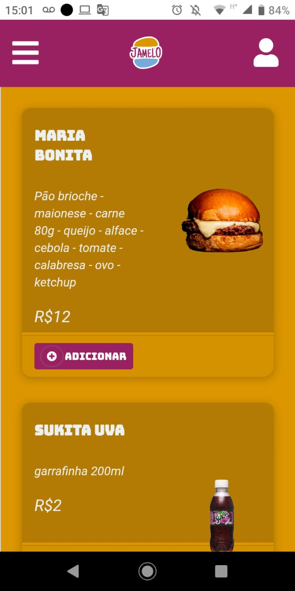
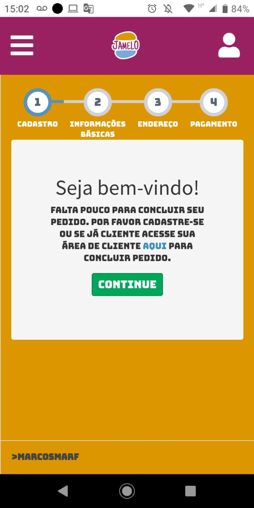
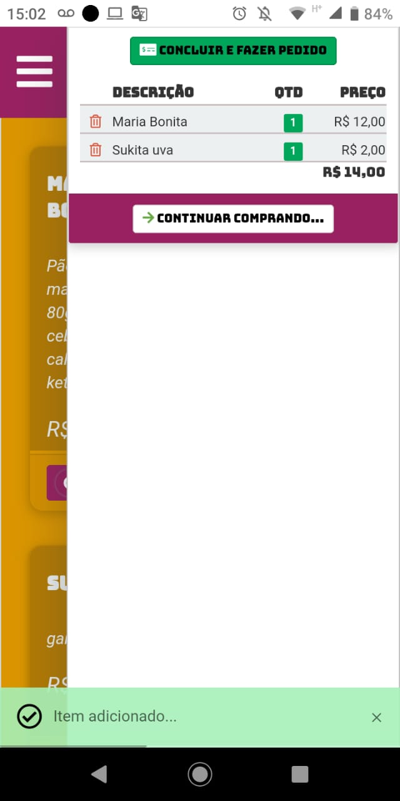
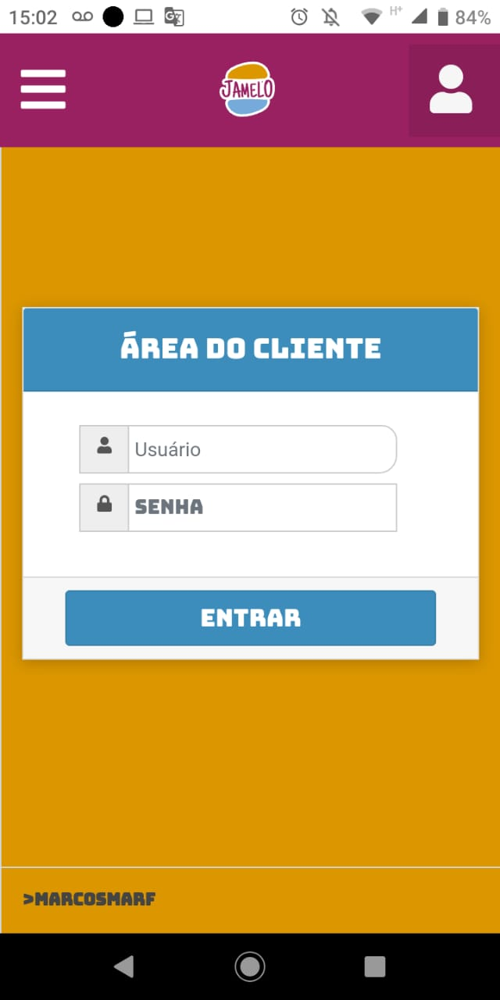
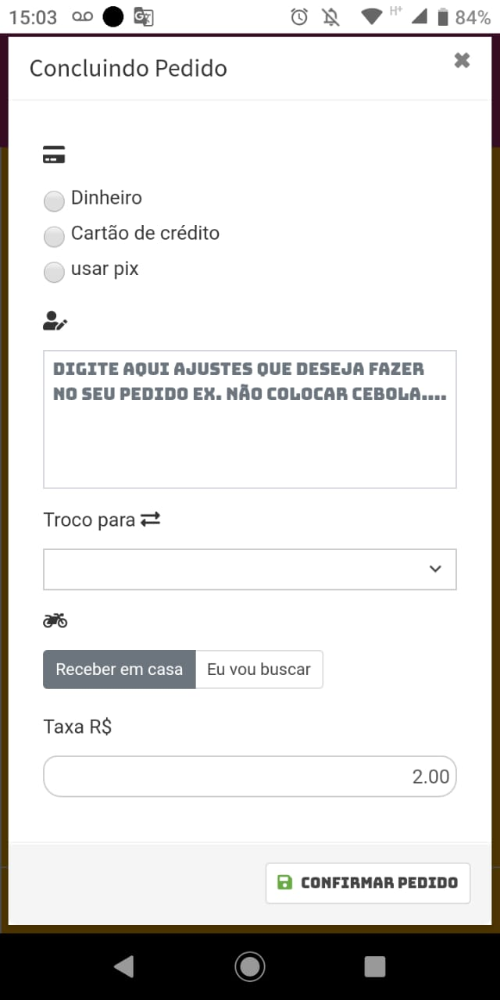
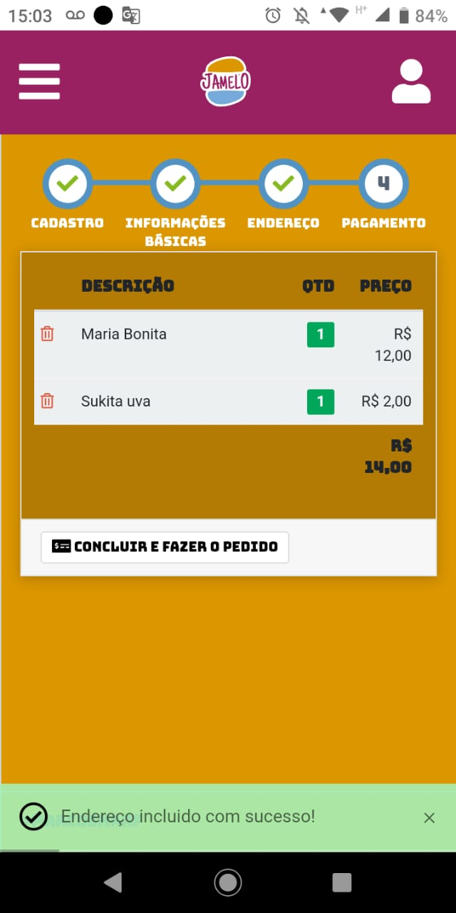

# SISTEMA DELIVERY JAMELO PARA DESKTOP, TABLET E CELULAR

<!---Esses são exemplos. Veja https://shields.io para outras pessoas ou para personalizar este conjunto de escudos. Você pode querer incluir dependências, status do projeto e informações de licença aqui--->

##APP JAMELO

> o SISTEMA DE JAMELO gerencia e controla os pedidos da hamurgueria com visual peronsalizado e valorizando a marca.

### Ajustes e melhorias

O projeto ainda está em desenvolvimento e as próximas atualizações serão voltadas nas seguintes tarefas:

- [x] Área do cliente
- [x] Área administrativa
- [x] plano de fidelidade
- [x] notificações
- [x] configuração e instalação aws amazon
- [x] otimização de dados e banco de dados
- [x] Dashboard
- [x] Emissão de som nos pedidos

## 😄 Seja um dos contribuidores 

Quer fazer parte desse projeto? Clique [AQUI](CONTRIBUTING.md) e leia como contribuir.

## 📝 Licença

Esse projeto está sob licença. Veja o arquivo [LICENÇA](LICENSE.md) para mais detalhes.

[⬆ Voltar ao topo](#nome-do-projeto) 
